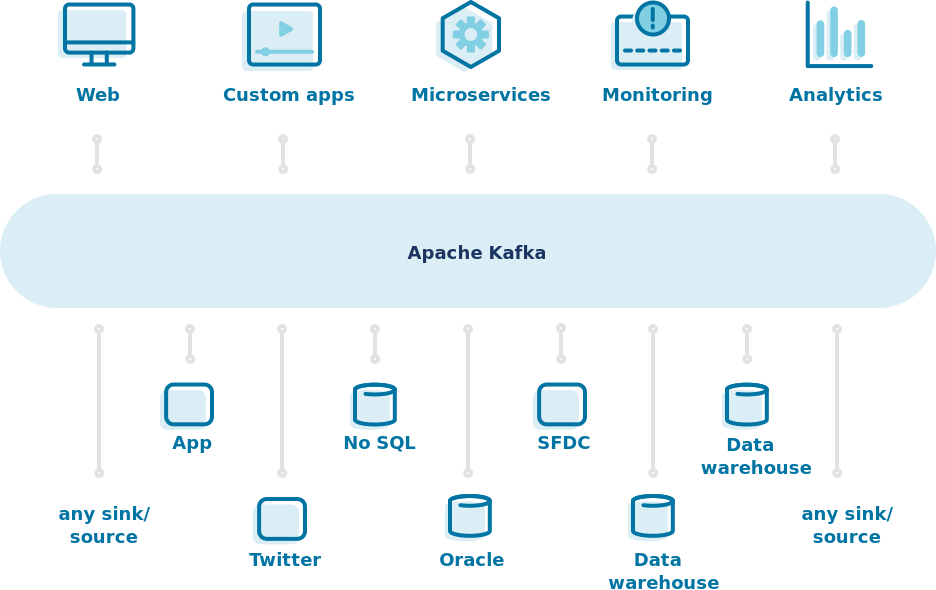
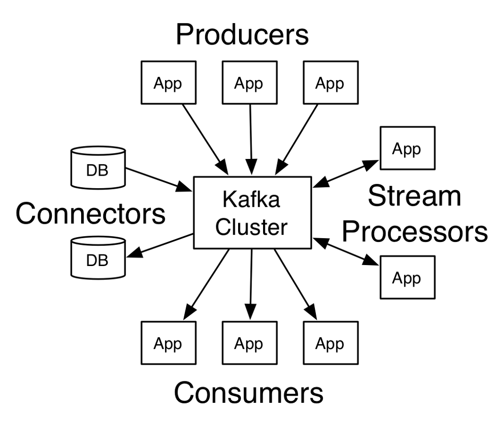

# Apache Kafka


## What is Apache Kafka?

Apache Kafka is an open-source distributed event streaming platform used by thousands of companies for high-performance data pipelines, streaming analytics, data integration, and mission-critical applications.

## What is event streaming in Kafka?

Event streaming is the digital equivalent of the human body's central nervous system. It is the technological foundation for the 'always-on' world where businesses are increasingly software-defined and automated, and where the user of software is more software.

Technically speaking, event streaming is the practice of capturing data in real-time from event sources like databases, sensors, mobile devices, cloud services, and software applications in the form of streams of events; storing these event streams durably for later retrieval; manipulating, processing, and reacting to the event streams in real-time as well as retrospectively; and routing the event streams to different destination technologies as needed. Event streaming thus ensures a continuous flow and interpretation of data so that the right information is at the right place, at the right time.

## Where Apache Kafka fits in?


## Getting Started with Apache Kafke
#### GET KAFKA
[Download](https://kafka.apache.org/downloads) the latest Kafka release and extract it: 
```
$ tar -xzf kafka_2.13-2.7.0.tgz
$ cd kafka_2.13-2.7.0
```

#### Python Libraries 

- kafka-python - Install the Python client for the Apache Kafka by running `pip3 install kafka-python`. This library is designed to function much like the official java client & can help publish and receive messages from Python. Alternatively, you may use `confluent-kafka-python` as well, but for this exercise, we would be using `kafka-python`.

#### Start the Kafka environment
Run the following commands in order to start all services in the correct order:

Start the ZooKeeper service
```
$ bin/zookeeper-server-start.sh config/zookeeper.properties
```

Open another terminal session and run:
Start the Kafka broker service
```
$ bin/kafka-server-start.sh config/server.properties
```
Once all services have successfully launched, you will have a basic Kafka environment running and ready to use.

## Usage

Once the Zookeeper and Kafka broker services are started, we can use the Python scripts on this repo.



#### Producers
Producers are the apps responsible to publish data into Kafka system. They publish data on the topic of their choice.
#### Using `producer.py`
Run the script to publish events to the newly created topic `sample`

#### Consumers
The messages published into topics are then utilized by Consumers apps. A consumer gets subscribed to the topic of its choice and consumes data.
#### Using `consumer.py`
Run the script to consume the events published by the producer. This script should write messages to the console.

#### Broker
Every instance of Kafka that is responsible for message exchange is called a Broker. Kafka can be used as a stand-alone machine or a part of a cluster.
